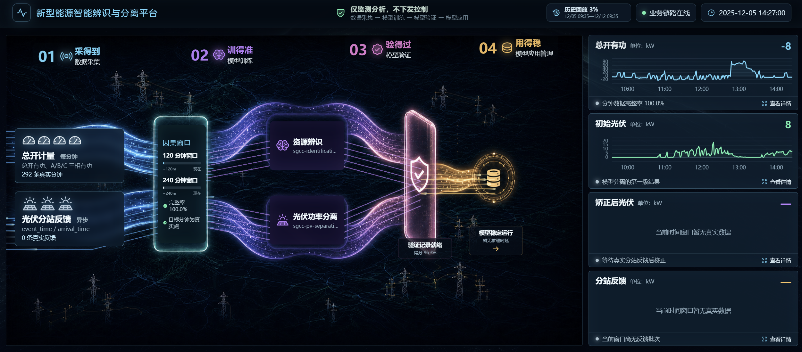
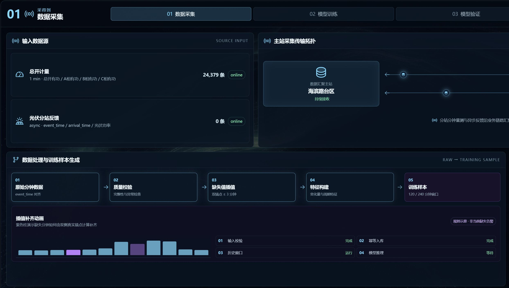
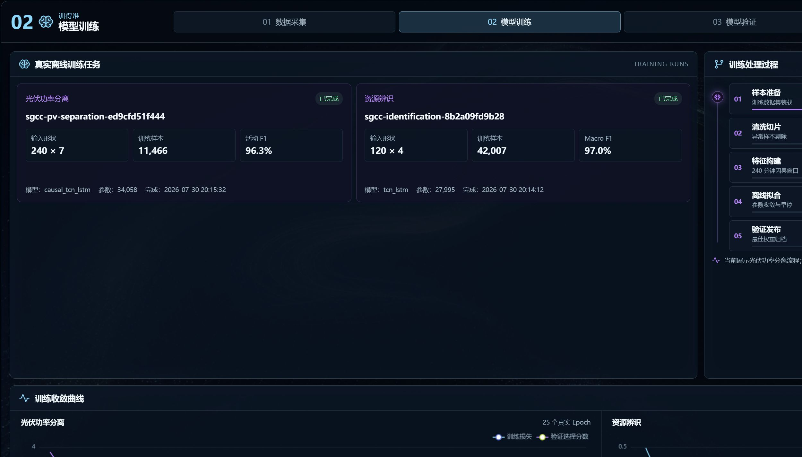
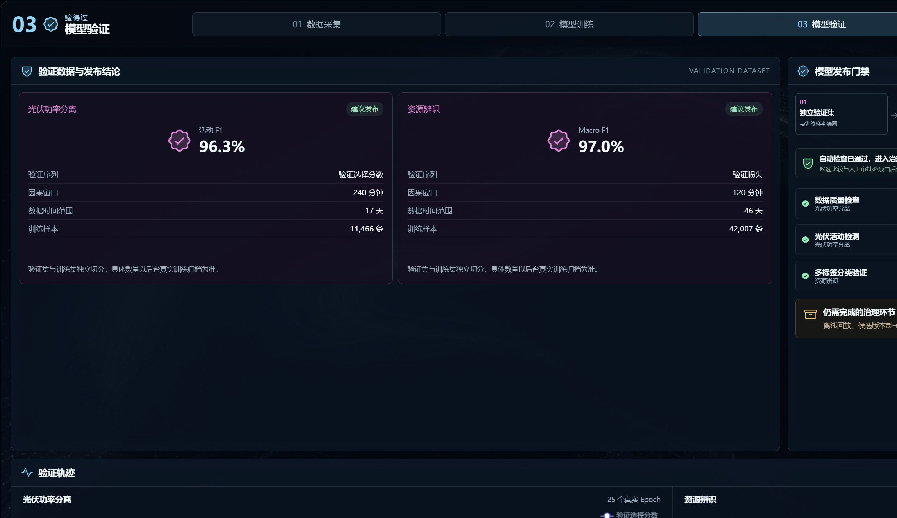
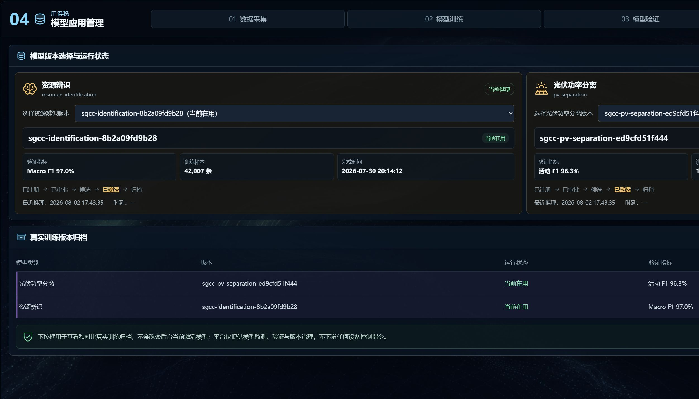
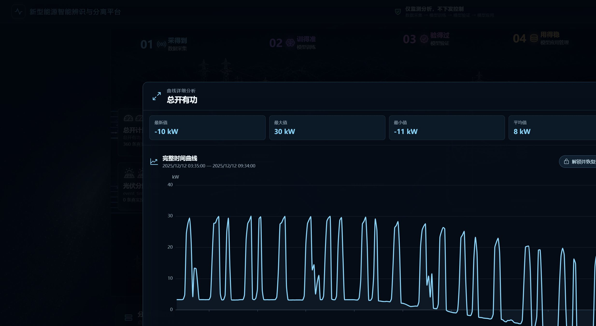
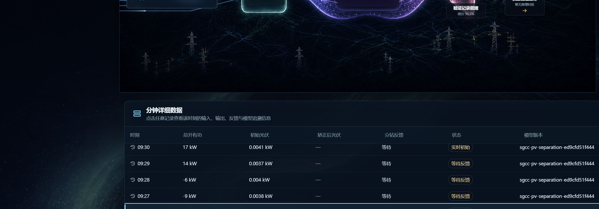

# 新型能源智能辨识与分离平台——界面使用说明

## 1. 平台用途

平台读取台区总开分钟功率和异步到达的光伏分站反馈，完成资源辨识、光伏功率分离、反馈校正、模型验证和版本治理。页面只提供监测分析，不向设备下发控制或调度指令。

四阶段业务链路为：

```text
01 数据采集 → 02 模型训练 → 03 模型验证 → 04 模型应用管理
```

- **资源辨识**回答“当前台区是否呈现光伏、能源站或充电桩特征”。
- **光伏功率分离**回答“模型从总开功率中估算出的光伏功率是多少”。
- **反馈校正**回答“真实分站反馈到达后，初始光伏结果需要修正多少”。
- **模型治理**回答“当前使用哪个真实模型版本，以及有哪些训练归档可查看”。

## 2. 首页驾驶舱



首页从上到下分为：平台与链路状态、四阶段能源流、四种关键曲线、分钟详细数据。

### 2.1 顶部状态

- 浏览器标签页和平台品牌均为“新型能源智能辨识与分离平台”。
- 台区下拉框用于切换后台真实台区。
- “业务链路在线 / 降级运行 / 链路离线”表示当前数据通道状态。
- 历史窗口用于选择起止时间并执行按分钟拟实时回放；“切换实时”返回实时模式。

### 2.2 四阶段能源流

点击 01–04 任一阶段可打开对应的全屏过程页。页面之间可以直接切换，不必先关闭。

### 2.3 四种关键曲线

首页右侧四张曲线卡片分别为：总开有功、初始光伏、矫正后光伏、分站反馈。点击任一卡片会打开独立的大图分析页。曲线和最近数据均来自当前真实/历史窗口；没有真实数据时显示空态，不生成模拟曲线。

## 3. 01 数据采集



页面采用紧凑栅格排列，卡片按内容高度对齐，避免出现整列或整行空洞。

### 3.1 输入数据源

显示总开计量、光伏分站反馈等真实接入源，包括采集频率、字段、接收条数和链路状态。“在线”表示链路可用，不等于已经收到反馈记录。

### 3.2 主站采集传输拓扑

多个分站节点通过业务链路向数据汇聚主站上送数据。移动光点代表正在传输的一批数据；分站名称、容量和通信状态来自后台节点记录。

### 3.3 数据处理与训练样本生成

动画从左到右说明：

```text
原始分钟数据 → 质量校验 → 缺失值插值 → 特征构建 → 训练样本
```

插值动画是规则示意，并非当前缺失告警。平台只允许在两端都有真实锚点且缺口不超过 3 分钟时插值；资源辨识使用 120 分钟因果窗口，光伏功率分离使用 240 分钟因果窗口。

### 3.4 特征、原始信号与输出

- 特征卡片解释总开有功、三相有功、分钟变化量和日内周期位置。
- 原始信号曲线直接读取采集过程接口。
- 输出卡片说明 120/240 分钟窗口分别产生的训练样本和模型输入。

## 4. 02 模型训练



### 4.1 真实训练任务

每张任务卡显示任务类型、模型版本、输入形状、训练样本、验证指标、模型参数和完成时间。所有数值来自真实训练归档；没有记录时显示空态。

### 4.2 动态训练流水线

光点按实际归档步骤推进，说明样本准备、清洗切片、特征构建、离线拟合和验证发布等阶段。步骤右侧显示真实状态或进度。页面只回放归档，不会在浏览器中启动训练。

### 4.3 收敛曲线

曲线使用后台真实 Epoch：训练损失反映拟合误差，验证曲线反映独立验证数据上的表现。只有后台有记录时才绘制。

## 5. 03 模型验证



验证页将发布前过程表达为：

```text
独立验证集 → 离线指标回放 → 规则门禁检查 → 候选影子比较 → 人工审批发布
```

- 验证卡片显示验证序列、因果窗口、数据范围、样本数和真实指标。
- 动态扫描只表达当前治理进度，不会自动补造候选比较或审批结果。
- “通过”仅表示该训练记录中的自动门禁已满足；外部测试、历史回放、候选比较和人工审批仍由后台真实记录决定。

## 6. 04 模型应用管理



资源辨识和光伏功率分离各有一个独立版本下拉框。选择归档版本后，卡片联动展示该版本的验证指标、训练样本、完成时间和生命周期位置。

- 下拉框用于查看和对比真实训练归档。
- 选择归档版本不会改变后台当前激活模型。
- 当前版本仍以后台模型健康记录为准。
- 若后台只有一个真实训练版本，下拉框只有一个选项，这是正常数据状态。

## 7. 曲线滑动窗口的锁定与解锁



在四种关键曲线任一独立页中拖动底部滑块或滚轮缩放后，页面会保存当前观察窗口，并显示“解锁并恢复全窗口”。点击按钮会清除已保存的缩放范围、恢复 0–100% 完整时间范围并重新跟随后续数据更新。四种曲线共用同一套行为。

## 8. 分钟详细数据的锁定与解锁



点击左侧任意分钟记录后，右侧详情固定在该时刻，并显示“已锁定 · 解锁”。锁定期间即使历史回放继续推进，详情仍保留所选分钟。点击解锁按钮后，详情恢复跟随全局当前分钟；再次点击某一行可重新锁定。

详情包括总开有功、初始/矫正后光伏、分站反馈、三相功率、置信度、反馈批次、模型版本、模型输入窗口和数据质量。

## 9. 数据边界

- `—` 表示没有该项数据或尚未产生，不能理解为 0 kW。
- 初始光伏是模型估算，不是真实分站反馈。
- 分站反馈未到达时，矫正后光伏、反馈批次和相关校正记录可能为空。
- `event_time` 是数据描述的业务时刻；`arrival_time` 是数据真正到达平台的时刻。
- 历史回放只显示当时已经可见的信息，不读取未来反馈。
- 降低动效设置或系统“减少动态效果”偏好会停止循环流程动画，并保留可读的最终状态。

## 10. 验收要点

1. 浏览器标题正确；四阶段页面可以打开、切换和关闭。
2. 01 页面没有大片空白，拓扑和处理成样动画可见。
3. 02/03 流程一眼可读，字号适合大屏查看。
4. 04 两个版本下拉框互不影响，选择只改变查看内容。
5. 四种曲线缩放后可解锁，解锁后恢复完整范围。
6. 分钟详情选择后可解锁，解锁后恢复自动跟随。
7. 页面无真实数据时显示空态，不生成伪造结果。
