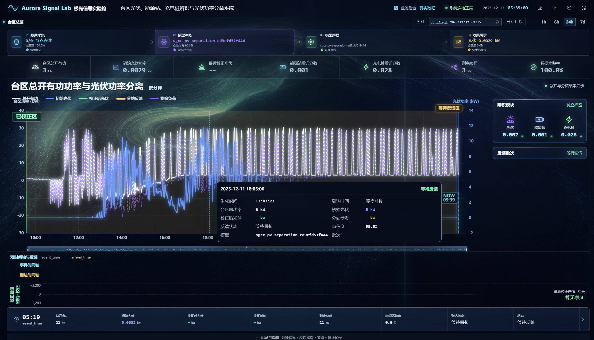
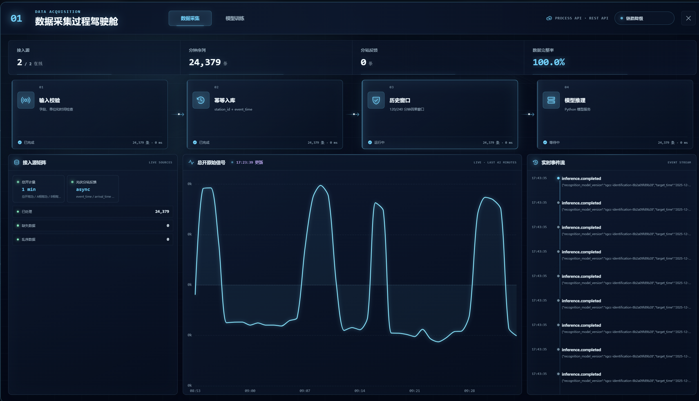

# 台区能源辨识与光伏功率分离平台——界面使用说明

## 1. 先用一句话认识本系统

本系统读取一个台区总开关处的分钟级用电功率，通过模型判断台区内是否存在光伏、能源站和充电桩等资源，并从总功率中估算光伏功率，帮助人员了解“台区总功率中有多少可能来自光伏，其余负荷还有多少”。

系统的主要工作流程是：

```text
采集台区总开数据和分站反馈
          ↓
离线训练并保存模型
          ↓
使用模型进行在线辨识和光伏功率分离
          ↓
在总览页展示曲线、状态和可追溯记录
```

其中：

- **资源辨识**回答“这个台区是否表现出光伏、能源站、充电桩的特征”。
- **光伏功率分离**回答“模型估算当前光伏功率是多少”。
- **反馈校正**回答“真实的光伏分站汇总数据到达后，模型估算值需要修正多少”。

## 2. 当前数据情况

> **当前系统没有光伏分站数据，也没有已到达的分站反馈批次。**

因此，当前页面中的以下信息应为空，而不是 `0`：

- **校正后光伏**：显示 `—`；
- **分站参考 / 分站反馈**：显示 `—`，图中也不会出现琥珀色反馈点或反馈线；
- **校正差值**：显示 `—` 或 `暂无校正`；
- **反馈批次 / 到达批次**：显示 `等待回传`；
- **双时间轴中的反馈到达时间**：没有可绘制的到达记录；
- **分站反馈记录、节点记录、校正记录**：可能为空。

这里的 `—` 表示“没有该项数据或该项尚未产生”，**不能理解为功率等于 0 kW**。初始光伏是模型估算结果，不能冒充真实分站反馈，也不能冒充校正结果。

## 3. 图 1：台区总览



*图 1　台区总览：用于查看系统整体状态、资源辨识结果、光伏功率分离曲线以及反馈校正情况。截图中的数值仅用于说明界面位置，实际数值以系统当前数据为准。*

### 3.1 顶部信息栏

| 界面部分 | 功能和含义 |
| --- | --- |
| 系统名称 | 说明当前平台用于台区光伏、能源站、充电桩辨识，以及光伏功率分离。 |
| `业务后台 · 真实数据` | 表示页面正在读取业务后台中的真实数据，而不是前端模拟数据。 |
| `系统连接正常` | 表示浏览器与业务后台的数据链路正常。它不代表所有业务数据都已齐全，例如当前仍可能没有分站反馈。 |
| 日期和时间 | 系统当前的展示时刻，也是实时观察和历史回放的时间参照。 |
| 导入 / 导出 | 导入符合要求的数据文件（暂未实现），或导出当前结果。 |
| 问号图标 | 打开页面内的看图说明。 |
| 全屏图标 | 切换全屏显示，适合大屏演示。 |

### 3.2 实时、历史回放和时间范围

- **实时**：持续显示最新到达的数据。
- **历史回放至**：选择过去的某一时间，把系统画面恢复到“当时已经知道的信息”。晚于该时刻才到达的反馈不会提前显示，从而避免“用未来数据解释过去”。
- **开始回放**：按选择的截止时刻加载历史状态。
- **1h / 6h / 24h / 7d**：选择主图显示最近 1 小时、6 小时、24 小时或 7 天的数据。

### 3.3 四阶段业务流程

页面上方的四个卡片从左到右表示完整业务链路：

1. **数据采集**：接收总开分钟数据及光伏分站反馈，并检查完整性。
2. **模型训练**：展示最近一次真实的离线训练任务、模型版本和验证结果。训练不是每分钟都在线进行。
3. **模型推理**：模型使用最近的历史窗口生成辨识结果和初始光伏估算。
4. **效果展示**：把分钟结果、置信度、曲线和状态集中显示出来。

点击“数据采集”或“模型训练”卡片，可进入对应的过程驾驶舱，详见图 2 和图 3。

### 3.4 核心指标条

| 指标 | 通俗解释 |
| --- | --- |
| 台区总开有功 | 总开关处测得的台区整体有功功率。单位为 kW。 |
| 初始光伏功率 | 模型仅依据总开历史数据估算出的光伏功率，尚未经过分站反馈校正。 |
| 最近校正光伏 | 最近一个已经收到反馈并完成校正的光伏值。当前无分站数据，因此显示 `—`。 |
| 能源站辨识分数 | 模型认为当前窗口具有能源站特征的得分。它是辨识得分，不是能源站功率。 |
| 充电桩辨识分数 | 模型认为当前窗口具有充电桩特征的得分。它是辨识得分，不是充电桩功率。 |
| 剩余负荷 | 从台区总功率中扣除当前采用的光伏估算值后得到的其余负荷。没有校正值时采用初始光伏估算。 |
| 数据完整率 | 已接收数据相对于预期数据的完整程度。100% 表示本次检查未发现缺失，但不代表系统一定拥有分站反馈这种另一类数据。 |

### 3.5 主曲线图：每条线表示什么

主图名称为“台区总开有功功率与光伏功率分离”，横轴是时间，单位按分钟；左侧纵轴是台区功率，右侧纵轴是光伏功率，单位均为 kW。

| 图例 | 含义 |
| --- | --- |
| 总开有功（白色） | 总开关实测的台区整体有功功率。 |
| 初始光伏（蓝色） | 模型根据总开历史窗口得到的初始光伏估算。 |
| 校正后光伏（绿色） | 分站反馈到达后，对初始光伏进行校正得到的结果。当前无分站数据，因此不应出现有效绿线。 |
| 分站反馈（琥珀色） | 分站回传的光伏参考值，通常按反馈间隔形成点或阶梯线。当前无分站数据，因此不应出现有效反馈点或反馈线。 |
| 剩余负荷（紫色虚线） | 台区总功率扣除当前采用的光伏值后剩下的负荷。 |

可点击或悬停某一分钟查看明细，包括生成时间、总功率、初始光伏、校正后光伏、分站参考、反馈状态、置信度、模型版本和批次。当前无分站数据时，校正后光伏和分站参考显示 `— kW`，到达时间显示“等待回传”。

### 3.6 `NOW`、`等待反馈区`、`已校正区`

这三个标记描述的是“在当前观察时刻，各段历史数据处于什么处理阶段”。

```text
较早的历史                                               当前时刻
┌──────────── 已校正区 ────────────┬──── 等待反馈区 ────┬─ 实时初始区 ─┐
│ 已收到分站反馈，可形成校正结果    │ 初始结果已有，反馈未到 │ 最近约 5 分钟 │ NOW
└───────────────────────────────────┴─────────────────────┴──────────────┘
```

- **`NOW`**：当前播放/观察时刻的边界。竖线左侧是截至此刻系统可见的数据，右侧不会绘制未来数据。历史回放时，`NOW` 指回放截止时刻，不一定是现实世界的当前时间。
- **实时初始区**：`NOW` 左侧最近约 5 分钟。这里通常已有总开数据和模型初始结果，但仍属于刚生成的实时结果。
- **等待反馈区**：从“最后一个已校正反馈覆盖时刻”到实时初始区之前的范围。这里已有初始光伏估算，但尚未获得能覆盖该时间段的分站反馈，所以不能生成校正后光伏。
- **已校正区**：已经被到达的分站反馈覆盖、理论上可以形成校正结果的历史范围；绿色校正曲线只应出现在这里。

> **结合当前实际数据理解：**因为当前没有任何分站反馈，“最后一个已校正反馈覆盖时刻”不存在，页面中的“已校正区”实际上没有有效校正数据。即使图表边界处仍能看到“已校正区”的标签，也不能据此认为已经产生校正结果；应以绿色校正曲线、反馈批次和校正记录是否真实存在为准。当前应重点理解为：绝大部分既有初始结果仍处于“等待反馈”，最新几分钟属于“实时初始”。

### 3.7 右侧辨识模块与反馈批次

- **辨识模块**：分别显示光伏、能源站和充电桩三个独立标签的辨识得分。三个标签可以同时出现，并不是只能三选一。
- **光伏辨识得分**：反映输入窗口呈现光伏活动特征的程度；它不是光伏功率值。
- **能源站 / 充电桩辨识得分**：只表示存在相应特征的程度。当前系统不会输出能源站或充电桩的分离功率。
- **反馈批次**：显示最近一次分站反馈的批次编号、到达时间、覆盖的历史范围、反馈间隔、节点覆盖和完整度。当前无分站数据，因此显示“等待回传”。

### 3.8 双时间轴与反馈

这一部分用于说明“数据所描述的时间”和“数据真正到达系统的时间”可能不同：

- **`event_time`（事件时间）**：功率值实际对应的业务时刻，例如某分站在 17:30 的光伏功率。
- **`arrival_time`（到达时间）**：这条反馈真正传到平台的时刻，例如 17:45 才回传。
- 两个时刻之间的水平时间差就是**反馈延迟**。

当前无分站反馈，因此这一部分没有可显示的到达点和延迟连线。

### 3.9 校正差值区

校正差值表示：

```text
校正差值 = 校正后光伏 − 初始光伏
```

- 正值表示校正后结果高于初始估算；
- 负值表示校正后结果低于初始估算；
- 当前无分站反馈，因此显示“最新校正差值：暂无 / 暂无校正”。

### 3.10 选中分钟与记录追溯

点击主图中的某一分钟后，底部会显示该分钟的总开有功、初始光伏、校正后光伏、校正差值、剩余负荷、辨识置信度、到达批次和状态。

点击底部分钟条或“记录与追溯”，可查看：

- 分钟级结果；
- 分站反馈批次；
- 分站节点记录；
- 校正记录。

当前无分站数据时，后三类记录可能为空，这是正常现象，不是页面故障。

## 4. 图 2：数据采集过程驾驶舱



*图 2　数据采集过程驾驶舱：用于观察数据从接入、检查、入库、组建历史窗口到送入模型的全过程。*

### 4.1 顶部汇总指标

| 指标 | 含义 |
| --- | --- |
| 接入源 | 当前处于在线状态的数据源数量 / 数据源总数。数据源在线只表示链路可用，不代表一定已经收到记录。 |
| 分钟序列 | 已接收的总开分钟级记录数量。 |
| 分站反馈 | 已接收的光伏分站反馈数量。当前应为 0。 |
| 数据完整率 | 对已接入数据进行完整性检查后的结果。 |

### 4.2 四个采集处理步骤

1. **输入校验**：检查字段、单位和时间格式是否正确。
2. **幂等入库**：按照 `station_id + event_time` 等唯一标识保存数据，避免同一条数据被重复写入。
3. **历史窗口**：准备模型所需的连续历史数据。资源辨识使用最近 120 分钟，光伏功率分离使用最近 240 分钟。
4. **模型推理**：把准备好的数据交给 Python 模型服务，生成辨识与分离结果。

卡片底部的“已完成 / 运行中 / 等待中 / 失败”表示步骤状态；“多少条 · 多少 ms”分别表示已处理记录数和处理耗时。

### 4.3 接入源矩阵

- **总开计量**：通常按 1 分钟接收，包含总开有功、A/B/C 三相有功等字段。
- **光伏分站反馈**：异步到达，包含事件时间、到达时间和光伏功率。
- **已处理 / 缺失数据 / 乱序数据**：用于判断数据接入质量。

当前没有分站数据时，“光伏分站反馈”可能仍显示为可连接或在线的数据源，但其接收数量应为 0。这里的“在线”表示接口链路状态，不等于“已有反馈内容”。

### 4.4 总开原始信号

中间曲线显示最近一段时间接收到的总开原始有功功率，用于快速判断信号是否持续更新、是否有明显缺口或异常突变。横轴为时间，纵轴为功率。

### 4.5 实时事件流

右侧按时间倒序显示采集和推理事件，例如 `inference.completed` 表示一次模型推理已经完成。事件详情可帮助排查某个时刻系统进行了什么处理。

## 5. 图 3：模型训练过程驾驶舱


*图 3　模型训练过程驾驶舱：用于展示最近一次真实离线训练记录及其逐轮指标回放，不代表模型正在持续在线学习。*

### 5.1 顶部训练指标

| 指标 | 含义 |
| --- | --- |
| 真实训练任务 | 可在“光伏分离”和“特征辨识”等真实训练记录之间切换。 |
| 当前训练轮次 | 当前回放到第几轮训练（Epoch）/ 总轮数。Epoch 可理解为模型完整学习一遍训练数据。 |
| 当前训练损失 | 模型在当前轮的误差指标，通常越低越好，但仍需结合验证结果判断。 |
| 有效训练样本 | 实际参与训练的数据样本数量。 |
| 光伏活动 F1 / Macro F1 | 综合衡量识别准确性的验证指标，通常越接近 100% 越好。 |

### 5.2 五个训练步骤

1. **样本准备**：装载训练数据集。
2. **清洗切片**：剔除异常样本，并切分成模型可用的数据片段。
3. **特征构建**：根据任务构建 120 分钟或 240 分钟的因果窗口；“因果”表示不读取目标时刻之后的未来数据。
4. **离线拟合**：训练模型参数，并通过早停等机制避免无效训练。
5. **验证发布**：选择最佳权重、完成验证并归档模型版本。

### 5.3 模型收敛曲线

- 横轴 `E1、E2……` 表示训练轮次；
- **训练损失**表示模型对训练样本的拟合误差；
- **验证曲线**表示模型在未直接参与训练的验证数据上的表现；
- 曲线总体趋于稳定，说明训练逐渐收敛；如果训练损失持续下降而验证表现恶化，可能出现过拟合。

下方进度条是对真实训练日志的逐 Epoch 回放，用于展示训练过程；它不是重新启动了一次训练。

### 5.4 训练运行监控

这里显示训练任务类型、模型版本、模型输入窗口、训练样本数、最佳验证值、最低训练损失和任务最终状态。模型版本号用于追溯“当前结果由哪一个模型产生”。

### 5.5 模型发布评估

模型只有通过相应检查后才适合进入发布流程。例如光伏分离任务通常包含：

- 数据质量检查；
- 功率回归验证；
- 光伏活动检测。

“通过”表示该次训练记录中的发布检查已满足要求；它不代表模型无需在其他台区进行外部测试、历史回放和人工审批。

## 6. 常用术语速查

| 术语 | 最简单的理解 |
| --- | --- |
| 台区 | 由同一配电变压器供电的一片低压用电区域。 |
| 总开 | 台区总开关或总计量点，可观察整个台区汇总功率。 |
| 有功功率 | 真正用于做功和用电的功率，本系统使用 kW。 |
| 光伏分站 | 提供实际光伏测量值的分布式数据节点。 |
| 初始光伏 | 模型从总开信号中估算出的光伏功率。 |
| 分站参考 | 已回传的各光伏分站数据汇总后形成的参考值。 |
| 校正后光伏 | 使用分站参考对初始光伏修正后的结果。 |
| 剩余负荷 | 台区总功率扣除光伏估算值后的其余负荷。 |
| 置信度 / 辨识得分 | 模型对结果把握程度的指标，不等于实际功率。 |
| 反馈批次 | 一次到达平台、覆盖一段历史时间的分站反馈集合。 |
| `event_time` | 数据实际描述的业务时刻。 |
| `arrival_time` | 数据真正到达平台的时刻。 |
| `NOW` | 当前实时或历史回放的观察边界。 |
